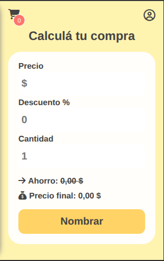
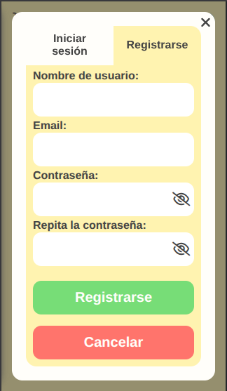
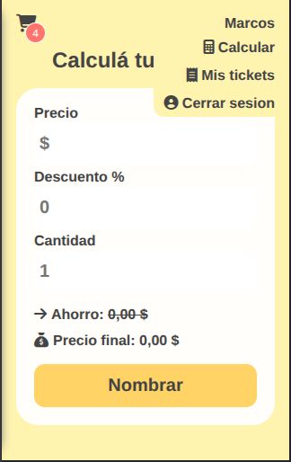
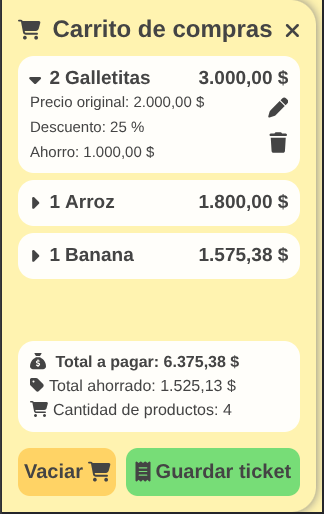
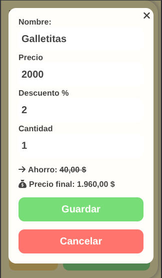
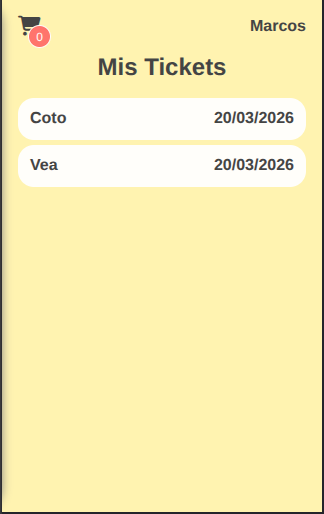
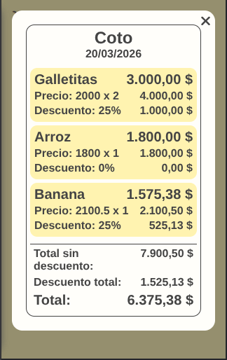

# 🛒 Shopping Calculator App

Aplicación web fullstack diseñada para ayudar a los usuarios a calcular el costo real de sus compras antes de llegar a la caja, permitiendo llevar un control en tiempo real del gasto y los descuentos aplicados.

Pensada especialmente para uso móvil, con una interfaz simple e intuitiva, accesible incluso para usuarios con poca experiencia tecnológica.

---

## 🚀 Demo

🔗 https://shopping-calculator-production.up.railway.app/

---

## 🧠 Problema que resuelve

En el día a día, es común no saber con precisión cuánto se va a pagar en una compra hasta el momento de pasar por caja.

Esta aplicación permite:

- Calcular descuentos en tiempo real
- Visualizar el total acumulado
- Controlar el ahorro generado
- Evitar sorpresas al pagar

---

## ✨ Features

### 🔐 Autenticación
- Registro e inicio de sesión
- Logout
- Autenticación con JWT (Access + Refresh Tokens)
- Tokens almacenados en cookies seguras (`httpOnly`, `secure`)
- Renovación automática de sesión

---

### 🛒 Gestión de compras
- Agregar productos al carrito
- Editar y eliminar productos
- Cálculo automático de:
  - Precio con descuento
  - Ahorro por producto
  - Total final
  - Ahorro total

---

### 💾 Persistencia
- Guardado del carrito como "Ticket"
- Historial de compras por usuario
- Visualización de detalle de cada ticket

> Los tickets no pueden ser editados ni eliminados una vez guardados

---

### 📱 UX orientada a mobile
- Interfaz pensada para uso en supermercado
- Flujo rápido e intuitivo
- Accesible para usuarios no técnicos

---

## 🔐 Autenticación (detalle técnico)

- Access Token (exp: 1 hora)
- Refresh Token (exp: 7 días)
- Ambos almacenados en cookies seguras

### Flujo:
1. Login → se generan ambos tokens
2. Access token se usa para requests autenticadas
3. Si expira:
   - Se valida refresh token
   - Se genera un nuevo access token automáticamente
4. Middleware backend protege rutas privadas

---

## 🧱 Arquitectura

### Backend (Node.js + Express)

Patrón MVC:
controllers/
routes/
middlewares/
validations/
database/

- Sequelize ORM
- Uso de migrations
- Separación de responsabilidades

> ⚠️ Actualmente la lógica se encuentra en controllers (mejora futura: capa de servicios)

---

### Base de datos (MySQL)

#### Users
- id
- name
- email
- password

#### Tickets
- id
- userId (FK)
- name
- productList (JSON)

---

### Frontend (React)

- React + React Router
- Protección de rutas
- Manejo de estado local
- Validaciones en frontend + backend

#### 🍪 Manejo de carrito

- Persistido en cookies (cliente)
- Funciona sin autenticación
- Requiere login para guardarse como ticket  
⚠️ Limitación:
- No sincroniza entre dispositivos

---
### ⚙️ Stack tecnológico
#### Frontend
- React
- React Router
- React Cookie

#### Backend
- Node.js
- Express
- JWT
- Sequelize

#### Base de datos
- MySQL

#### DevOps
- Docker
- Docker compose
- Railway (deploy)

---
### 🐳 Instalación con Docker (recomendado)
```
git clone https://github.com/Marcos676/shopping-calculator-app.git
cd shopping-calculator-app
```
Crear archivo .env basado en:
```
.env.example
```
Luego ejecutar: 
```
docker compose -f docker-compose-dev.yml up
```
---

### ⚙️ Instalación manual (sin Docker)
#### Backend
```
cd server
npm install
```
Crear .env y ejecutar:
```
npm run deploy:db
npm run start
```
---
#### Frontend
```
cd client
npm install
npm start
```
---
### 🌐 Deploy
Aplicación desplegada en Railway:
- Backend
- Frontend
- Base de datos  
Configurados como servicios separados dentro del mismo proyecto.

---

### ⚠️ Limitaciones actuales
- Carrito basado en cookies (no sincronizado)
- No se pueden editar/eliminar tickets
- UI desktop mejorable
- Sin tests automatizados

---

### Mejoras futuras
- Implementar capa de servicios en backend
- Migrar carrito a backend (persistencia real)
- Agregar tests (Jest / Supertest)
- Mejorar UI para desktop
- Manejo global de estado en frontend
- Interceptors para manejo automático de tokens

---

### 📸 Screenshots








---

### Autor
Desarrollado por Marcos676